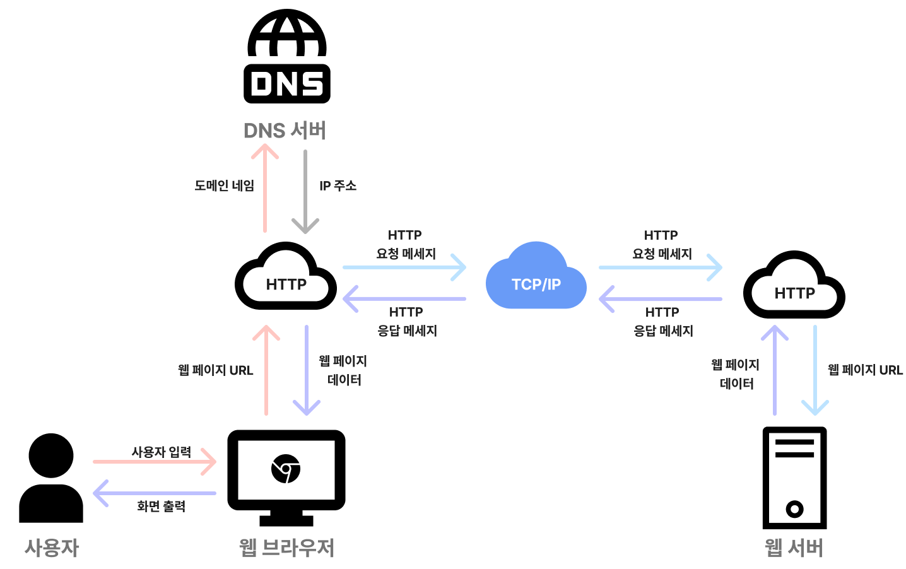

# 브라우저의 작동 원리

브라우저는 웹 페이지를 사용자에게 보여주기 위해 다양한 기술과 절차를 수행하는 소프트웨어입니다. 웹 브라우저의 기본적인 작동 과정을 단계별로 설명하면 다음과 같습니다.

## 1. URL 입력 및 요청

사용자가 브라우저의 주소창에 URL을 입력하거나 링크를 클릭하면, 브라우저는 해당 URL의 리소스를 요청합니다. 이때 브라우저는 **HTTP** 또는 **HTTPS** 프로토콜을 사용하여 웹 서버와 통신하며, 주로 다음과 같은 절차를 거칩니다:

- **DNS 조회**: 도메인 네임 시스템(DNS)을 통해 사용자가 입력한 URL을 IP 주소로 변환합니다.
- **HTTP 요청**: 변환된 IP 주소를 통해 웹 서버에 HTTP 요청을 보냅니다. 이 요청은 메서드(GET, POST 등), 헤더, 파라미터를 포함합니다.

## 2. 서버 응답

서버는 클라이언트의 요청을 처리한 후, 브라우저에 **HTTP 응답**을 반환합니다. 이 응답은 다음과 같은 내용을 포함합니다:

- **상태 코드**: 요청의 성공 여부를 나타냅니다. (예: 200 OK, 404 Not Found)
- **헤더**: 응답의 메타 데이터를 포함합니다. (예: 콘텐츠 타입, 캐싱 정보)
- **본문**: 웹 페이지의 HTML, CSS, JavaScript와 같은 실제 데이터를 포함합니다.

## 3. HTML 파싱 및 DOM 트리 생성

브라우저는 서버로부터 받은 HTML 문서를 **HTML 파서**로 파싱하여 **DOM(Document Object Model)** 트리를 생성합니다.

- **HTML 파싱**: HTML 태그를 파싱하여 각 태그를 DOM 트리의 노드로 변환합니다.
- **DOM 트리 생성**: HTML 문서의 계층 구조에 맞춰서 브라우저는 DOM 트리를 만듭니다. 이 트리는 브라우저가 화면에 웹 페이지를 렌더링하는 데 핵심적인 역할을 합니다.

## 4. CSS 파싱 및 스타일 계산

서버에서 받은 CSS 파일이나 HTML 내부의 `<style>` 태그는 **CSS 파서**에 의해 파싱되어 **CSSOM(CSS Object Model)** 트리가 생성됩니다. 브라우저는 이를 사용하여 각 DOM 요소의 스타일을 계산합니다.

- **CSSOM 트리 생성**: CSS 규칙을 기반으로 DOM 요소와 연결된 스타일 규칙을 정의합니다.
- **스타일 계산**: CSSOM과 DOM 트리를 조합하여 각 요소의 스타일을 계산합니다.

## 5. 레이아웃 (Reflow)

브라우저는 스타일 계산이 끝난 후 **레이아웃 단계**에서 각 요소의 크기와 위치를 계산합니다. 이 단계에서는 DOM과 CSSOM 트리를 이용하여 웹 페이지의 각 요소가 화면에서 어떻게 배치될지 결정됩니다.

- **박스 모델**: 각 요소는 브라우저에서 박스 형태로 처리되며, 이 박스의 크기와 위치가 결정됩니다.

## 6. 페인팅 (Painting)

브라우저는 레이아웃 계산이 완료되면, **페인팅 단계**에서 각 요소를 실제로 화면에 그리기 시작합니다. 이때 요소의 색상, 테두리, 그림자 등 스타일 정보를 사용하여 화면에 요소를 그립니다.

## 7. 자바스크립트 실행

브라우저는 **JavaScript 엔진**을 사용하여 HTML 문서에 포함된 자바스크립트 코드를 실행합니다. 이때 자바스크립트는 DOM 트리나 CSSOM 트리에 접근하거나 수정할 수 있으며, 페이지의 동적인 기능을 수행할 수 있습니다.

- **DOM 조작**: 자바스크립트는 DOM 요소를 추가하거나 삭제할 수 있습니다.
- **이벤트 핸들링**: 브라우저는 자바스크립트의 이벤트 리스너를 통해 사용자 상호작용을 처리합니다.

## 8. 렌더링 업데이트

자바스크립트 코드가 DOM이나 CSSOM을 변경하면, 브라우저는 다시 **레이아웃**이나 **페인팅** 과정을 거쳐 화면을 업데이트합니다. 이 과정을 **리렌더링**이라고 합니다.

## 9. 최적화 및 캐싱

브라우저는 성능을 향상시키기 위해 다양한 **최적화** 기법을 사용합니다. 대표적으로 다음과 같은 기법들이 있습니다:

- **캐싱**: 자주 사용하는 리소스를 로컬에 저장하여, 재요청 시 네트워크를 통하지 않고 빠르게 불러옵니다.
- **프리페칭**: 브라우저는 사용자가 방문할 가능성이 높은 리소스를 미리 로드하는 기법입니다.
