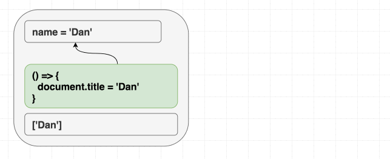
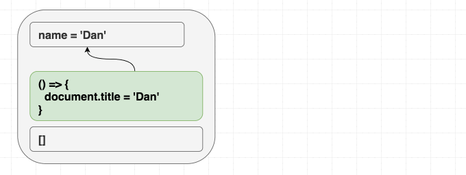

웹에 대한 소개
브라우저에 대한 소개

js의 등장
-> 상호작용이 가능

구글은 ajax를 통해서 페이지를 새로고침하지 않고 데이터를 가져올 수 있게 했다. 이러한 시도는 gmail과 google map등을 만들며 점유율을 높이는데 큰 역할을 했다. 

jQuery의 등장
-> 브라우저 호환성 문제를 해결
Dom조작과 이벤트 처리가 간편해지기 시작

이로 인해서 웹에서 많은 것들을 처리하기 시작 -> 구글 페이스북 등 인터넷 강자들의 등장

단점이 부각됨
- 느림
- SPA개발에 힘듬
  - 특정 페이지의 경우 전체를 다시 그리기 보다 일부만 바꿔 끼는 경우가 많은데 이러한 경우에는 불필요한 리소스를 다시 받아와야 하는 경우가 많다.
- 유지보수성의 문제

react
- 페이스북이 만듬 https://www.youtube.com/watch?v=8pDqJVdNa44
- 모든 개발의 단위를 컴포넌트로 쪼개고 이를 조립해서 화면을 구성
- "State"가 변하면 화면이 다시 그려짐
- virtual DOM을 사용해 필요한 애들만 다시 그려짐

---


```
corepack enable pnpm
```

```
pnpm create vite
```

번들러?


새로운 버튼을 만들어서 현재의 count를 3초 뒤에 띄워보세요
```typescript
function handleAlertClick() {
    setTimeout(() => {
      alert('You clicked on: ' + count);
    }, 3000);
  }
  ```

알럿 버튼을 누르고 3초 안에 count를 증가시키면 어떻게 될까요? 


```typescript

useEffect(() => {
    document.title = `You clicked ${count} times`;
  });
```


```typescript
// During first render
function Counter() {
  // ...
  useEffect(
    // Effect function from first render
    () => {
      document.title = `You clicked ${0} times`;
    }
  );
  // ...
}
 
// After a click, our function is called again
function Counter() {
  // ...
  useEffect(
    // Effect function from second render
    () => {
      document.title = `You clicked ${1} times`;
    }
  );
  // ...
}
 
// After another click, our function is called again
function Counter() {
  // ...
  useEffect(
    // Effect function from third render
    () => {
      document.title = `You clicked ${2} times`;
    }
  );
  // ..
}
```

```typescript
  useEffect(() => {
    setTimeout(() => {
      console.log(`You clicked ${count} times`);
    }, 3000);
  });
```

마찬가지로 1 2 3 4 5가 됨

어떻게 하면 가장 최신의 상태를 보도록 할 수 있을까요

```typescript
function Example() {
  const [count, setCount] = useState(0);
  const latestCount = useRef(count);
 
  useEffect(() => {
    // Set the mutable latest value
    latestCount.current = count;
    setTimeout(() => {
      // Read the mutable latest value
      console.log(`You clicked ${latestCount.current} times`);
    }, 3000);
  });
  // ...
```


클린업?


```typescript
  useEffect(() => {
    ChatAPI.subscribeToFriendStatus(props.id, handleStatusChange);
    return () => {
      ChatAPI.unsubscribeFromFriendStatus(props.id, handleStatusChange);
    };
  });
```

id가 10이었다가 20으로 바뀌면 어떻게 될까요?

클린업이 된 후(언마운트) id가 20인 상태가 렌더될까요?

리액트는 모든 이펙트를 브라우저가 페인트를 허용한 이후에 실행함 -> 

{id: 20} 에 대한 ui 생성

브라우저가 {id: 20} ui를 페인트

{id: 10}에 대한 클린업

{id: 20}에 대한 이펙트 실행

---


React는 현재 프로퍼티와 상태에 따라 DOM을 동기화함. 렌더링할 때 "마운트"와 "업데이트"를 구분하지 않음

이펙트도 비슷한 방식으로 생각해야 함. useEffect를 사용하면 props와 상태에 따라 React 트리 외부의 것들을 동기화할 수 있음

라이프 사이클이 아니라 동기화

만약 이펙트를 처음 렌더링인지 아닌지에 따라 다르게 동작하도록 작성하고 있다면 잘못하고 있는 것.

```typescript
function Greeting({ name }) {
  const [counter, setCounter] = useState(0);
 
  useEffect(() => {
    document.title = 'Hello, ' + name;
  });
 
  return (
    <h1 className="Greeting">
      Hello, {name}
      <button onClick={() => setCounter(count + 1)}>
        Increment
      </button>
    </h1>
  );
}
```

**리액트에게 의존성으로 거짓말을 하지 마세요**

```typescript
useEffect(() => {
    document.title = 'Hello, ' + name;
  }, [name]);
  ```



```typescript
useEffect(() => {
    document.title = 'Hello, ' + name;
  }, []);
  ```




이번엔 count가 1초에 하나씩 증가하도록 하는 코드를 만들어보세요.


---


의존성으로 거짓말하지 않는 두 가지 방법

1. 이펙트 안의 모든 상태와 프로퍼티를 의존성 배열에 넣기

2. 업데이터를 이용하기

```typescript
  export function Counter() {
    const [count, setCount] = useState(0);
    const [step, setStep] = useState(1);
   
    useEffect(() => {
      const id = setInterval(() => {
        setCount(c => c + step);
      }, 1000);
      return () => clearInterval(id);
    }, [step]);
   
    return (
      <>
        <h1>{count}</h1>
        <input value={step} onChange={e => setStep(Number(e.target.value))} />
      </>
    );
  }
```


step이 있는 경우 어떻게 하면 deps를 없앨 수 있을까요

어떤 상태가 다른 상태에 의존할 경우, 둘을 `useReducer`로 합칠 수 있습니다.

```typescript
const [state, dispatch] = useReducer(reducer, initialState);
const { count, step } = state;
 
useEffect(() => {
  const id = setInterval(() => {
    dispatch({ type: 'tick' }); // Instead of setCount(c => c + step);
  }, 1000);
  return () => clearInterval(id);
}, [dispatch]);
```

`dispatch`는 항상 같은 참조를 가지기 때문에 `useEffect`가 한번만 실행됩니다.

```typescript
const initialState = {
  count: 0,
  step: 1,
};
 
function reducer(state, action) {
  const { count, step } = state;
  if (action.type === 'tick') {
    return { count: count + step, step };
  } else if (action.type === 'step') {
    return { count, step: action.step };
  } else {
    throw new Error();
  }
}
```

만약 step이 props로 넘어온다면 디펜던시에 넣어야 할까요? 

---


```typescript
function SearchResults() {
  const [data, setData] = useState({ hits: [] });
 
  async function fetchData() {
    const result = await axios(
      'https://hn.algolia.com/api/v1/search?query=react',
    );
    setData(result.data);
  }
 
  useEffect(() => {
    fetchData();
  }, []); 
 
  // ...
```

```typescript
function SearchResults() {
  const [query, setQuery] = useState('react');
 
  // Imagine this function is also long
  function getFetchUrl() {
    return 'https://hn.algolia.com/api/v1/search?query=' + query; // 추가
  }
 
  // Imagine this function is also long
  async function fetchData() {
    const result = await axios(getFetchUrl());
    setData(result.data);
  }
 
  useEffect(() => {
    fetchData();
  }, []);
 
  // ...
}
```

함수를 특정 이펙트에서만 사용한다면 그 함수를 이펙트 안에 넣어서 사용하세요

---
안된다면?

```typescript
function SearchResults() {
  function getFetchUrl(query) {
    return 'https://hn.algolia.com/api/v1/search?query=' + query;
  }
 
  useEffect(() => {
    const url = getFetchUrl('react');
    // ... Fetch data and do something ...
  }, []); // 🔴 Missing dep: getFetchUrl
 
  useEffect(() => {
    const url = getFetchUrl('redux');
    // ... Fetch data and do something ...
  }, []); // 🔴 Missing dep: getFetchUrl
 
  // ...
}
```

위 경우 getFetchUrl은 모든 rerender에서 재생성되기 때문에 각 이펙트 들이 불필요하게 실행될 수 있음

```typescript
// ✅ Not affected by the data flow
function getFetchUrl(query) {
  return 'https://hn.algolia.com/api/v1/search?query=' + query;
}
 
function SearchResults() {
  useEffect(() => {
    const url = getFetchUrl('react');
    // ... Fetch data and do something ...
  }, []); // ✅ Deps are OK
 
  useEffect(() => {
    const url = getFetchUrl('redux');
    // ... Fetch data and do something ...
  }, []); // ✅ Deps are OK
 
  // ...
}
```

컴포넌트 밖으로 빼거나

```typescript
function SearchResults() {
  // ✅ Preserves identity when its own deps are the same
  const getFetchUrl = useCallback((query) => {
    return 'https://hn.algolia.com/api/v1/search?query=' + query;
  }, []);  // ✅ Callback deps are OK
 
  useEffect(() => {
    const url = getFetchUrl('react');
    // ... Fetch data and do something ...
  }, [getFetchUrl]); // ✅ Effect deps are OK
 
  useEffect(() => {
    const url = getFetchUrl('redux');
    // ... Fetch data and do something ...
  }, [getFetchUrl]); // ✅ Effect deps are OK
 
  // ...
}
```
useCallback을 사용하세요
